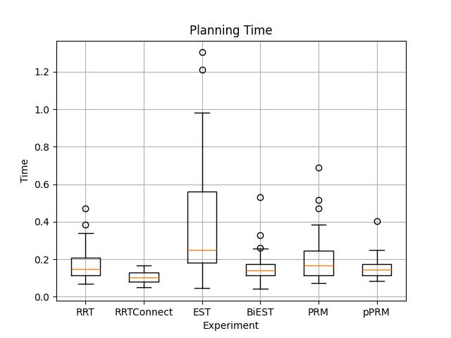
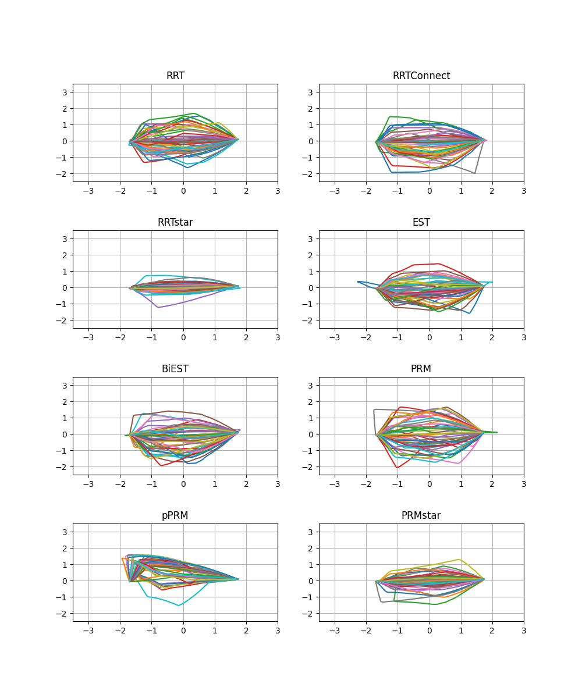
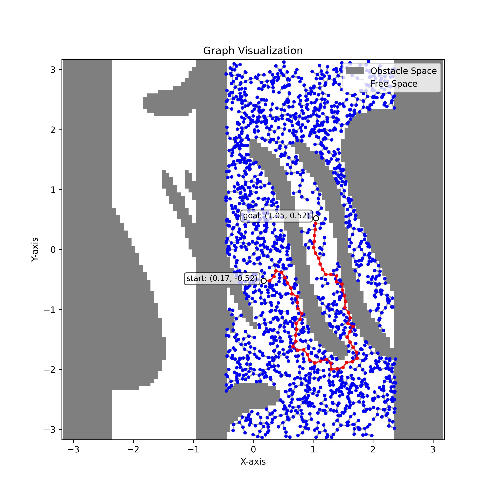
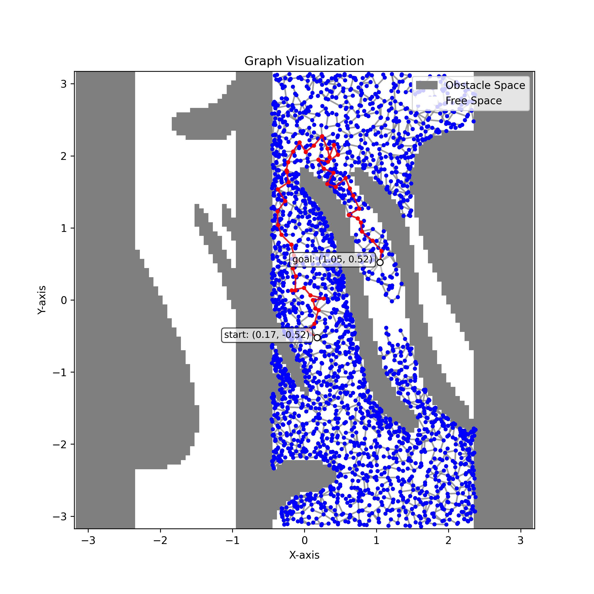
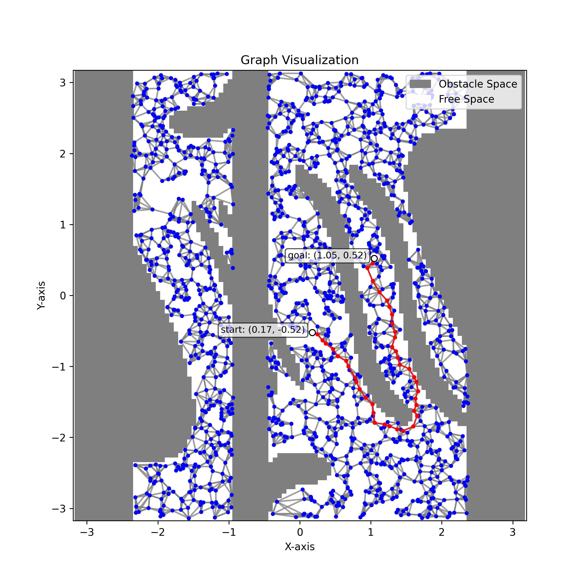
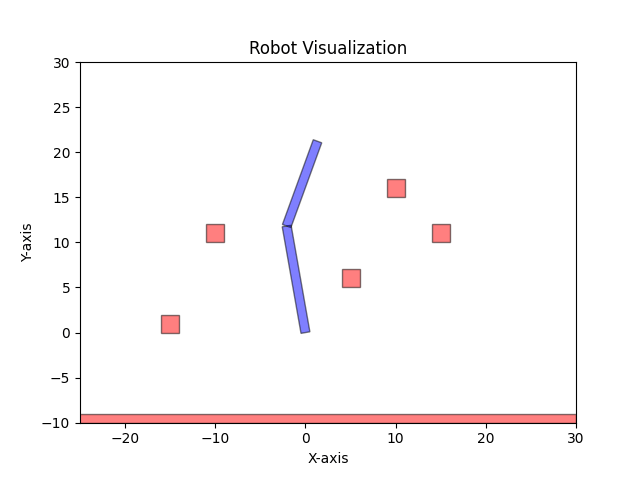

# Bachelor Thesis Attachments

This folder contains three projects that are part of my bachelor thesis submission. Each project contributes to the thesis in a unique way, as described below. For more detailed information about each project, please refer to their respective `README.md` files.

## Attachment Overview
- [**`README.md`**](README.md): This file provides an overview of the projects and their contributions to the thesis.
- [**`niryo_experiment`**](niryo_experiment/README.md): This project involves conducting quantitative experiments using a Niryo robot to gather data for comparing motion planning algorithms. Please refer to the [<u>`niryo_experiment/README.md` file</u>](niryo_experiment/README.md).
- [**`motion_analysis`**](motion_analysis/README.md): This project focuses on analyzing the experimental data collected from the `niryo_experiment` project. It generates graphs and insights that are used to compare and evaluate the performance of different motion planning algorithms. Please refer to the [<u>`motion_analysis/README.md` file</u>](motion_analysis/README.md).
- [**`c_space_viz`**](c_space_viz/README.md): This project provides visual representations of motion planning algorithms in a simple 2D environment using a 2-DOF robot. These visualizations are intended to help readers of the thesis better understand the concepts and practical applications of these algorithms. Please refer to the [<u>`c_space_viz/README.md` file</u>](c_space_viz/README.md).
- [**`thesis`**](thesis/): This folder contains the final version of [<u>my bachelor thesis</u>](thesis/thesis.pdf), and [<u>zipped source files</u>](thesis/thesis_src.zip) of the thesis in LaTex format.

## Projects Overview
### 1. [`niryo_experiment`](niryo_experiment/README.md)
This project is a **key component** of the thesis. It involves conducting quantitative experiments using a Niryo robot to gather data for comparing motion planning algorithms. The experimental data generated here serves as the foundation for further analysis.

    <figure align="center">
        
        <figcaption><b>Demonstration of the Automated Testing for Ned2</b></figcaption>
    </figure>

### 2. [`motion_analysis`](motion_analysis/README.md)
This project focuses on **analyzing the experimental data** collected from the `niryo_experiment` project. It generates graphs and insights that are used to compare and evaluate the performance of different motion planning algorithms.

    
    

### 3. [`c_space_viz`](c_space_viz/README.md)
This project aims to provide visual representations of motion planning algorithms in a simple 2D environment using a 2-DOF robot. These visualizations are intended to help readers of the thesis better understand the concepts and practical applications of these algorithms. The output figures are used to introduce motion planning algorithms in **chapter 2** of the thesis.

  <figure style="margin: 0; text-align: center;">
    
    <figcaption>RRT Graph</figcaption>
  </figure>

  <figure style="margin: 0; text-align: center;">
    
    <figcaption>EST Graph</figcaption>
  </figure>

  <figure style="margin: 0; text-align: center;">
    
    <figcaption>PRM Graph</figcaption>
  </figure>

  <figure style="margin: 0; text-align: center;">
    
    <figcaption>RRT Animation</figcaption>
  </figure>

  <figure style="margin: 0; text-align: center;">
    
    <figcaption>EST Animation</figcaption>
  </figure>

  <figure style="margin: 0; text-align: center;">
    
    <figcaption>PRM Animation</figcaption>
  </figure>

## Additional Content
- [<u>**`data.zip`**</u>](motion_analysis/data.zip): This file is located in the `motion_analysis` project. It contains the experimental data collected from the `niryo_experiment` project. It is used for analysis in the `motion_analysis` project. Our analysis is based on this data and supports the findings presented in the thesis.
- [<u>Link to experiment videos</u>](https://campuscvut-my.sharepoint.com/:f:/g/personal/kawasrik_cvut_cz/ElzsGvVkSRJKtZkDEYG8lpAB3j0Hk_znV5Ezgx0G2bH31A?e=ydE4fd): This link provides access to all the videos recorded during the experiments conducted in the `niryo_experiment` project. The videos are organized by test scene and can be used for further analysis or reference. (*Note:* the link is accessible only with CVUT credentials.)
    

## Notes
- Each subproject has its own `README.md` file with detailed descriptions of its purpose, implementation, and usage.
- The projects collectively support the objectives of the thesis by providing experimental data, analysis, and visualizations.

## Useful Links
- [Niryo Ned2 Documentation](https://docs.niryo.com/robots/ned2/)
- [Niryo Ned2 ROS Stack's Documentation](https://niryorobotics.github.io/beta_ned_ros_doc)
- [Niryo Resource Download Center](https://niryo.com/resources/download-center)
- [ROS Noetic Wiki](https://wiki.ros.org/noetic)
- [MoveIt! Tutorial](https://moveit.github.io/moveit_tutorials/)
