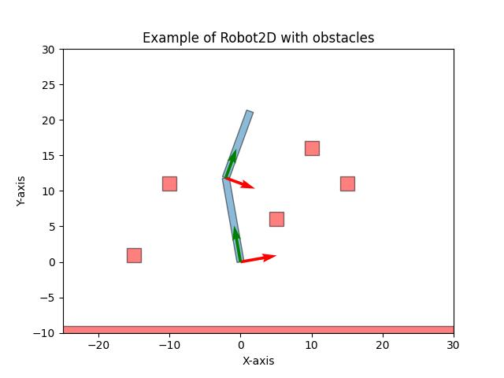
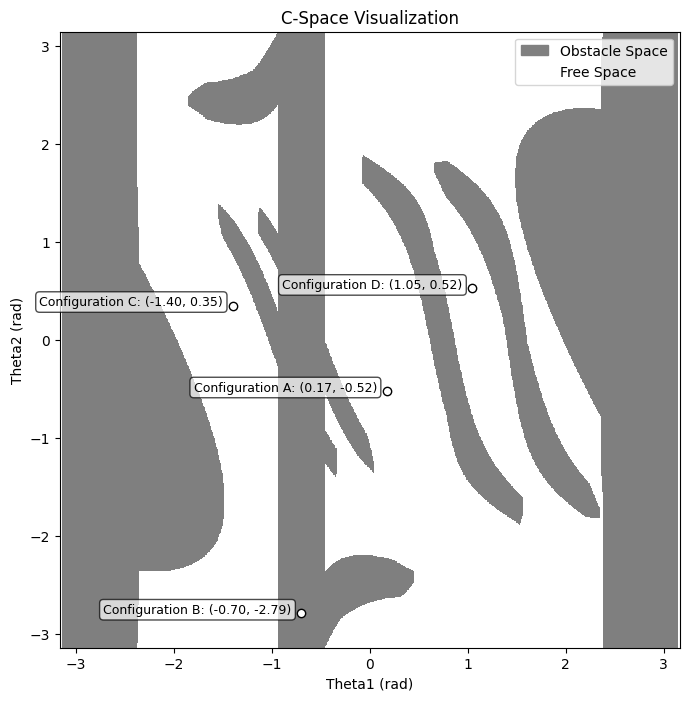

# C-Space Visualization for 2-DOF Robot

This project provides an easy-to-use environment for setting up a 2DOF robot workspace with obstacles and visualizing the configuration space (C-space) for the defined environment. It also implements and visualizes three sampling-based motion planning algorithms:

- **RRT (Rapidly-exploring Random Tree)**
- **EST (Expansive Space Trees)**
- **PRM (Probabilistic Roadmap)**

## Purpose

The aim of this project is to **demonstrate sampling-based motion planning** algorithms and provide thesis readers with a **visual insight** into these algorithms.
The output figures are used to introduce motion planning algorithms in **chapter 2** of my thesis *"Comparative Study of Motion Planning Algorithms for Niryo Robotic Arm"*.

## Features

- **Environment Setup**: Define a 2DOF robot workspace with customizable obstacles.
<p align="center">
    
</p>

- **C-Space Visualization**: Visualize the configuration space for the given environment.
<p align="center">
    
</p>

- **Graph Visualization**: Visualize the graphs generated by the planners in the C-space.
<p align="center">
  <figure style="display:inline-block; margin:10px; text-align:center;">
    
    <figcaption>RRT Graph</figcaption>
  </figure>
  <figure style="display:inline-block; margin:10px; text-align:center;">
    
    <figcaption>EST Graph</figcaption>
  </figure>
  <figure style="display:inline-block; margin:10px; text-align:center;">
    
    <figcaption>PRM Graph</figcaption>
  </figure>
</p>

- **Motion Planning**: Generate motion plans using RRT, EST, and PRM algorithms.
<p align="center">
    <figure style="display:inline-block; margin:10px; text-align:center;">
        
        <figcaption>RRT Animation</figcaption>
    </figure>
    <figure style="display:inline-block; margin:10px; text-align:center;">
        
        <figcaption>EST Animation</figcaption>
    </figure>
    <figure style="display:inline-block; margin:10px; text-align:center;">
        
        <figcaption>PRM Animation</figcaption>
    </figure>
</p>


## Getting Started

### Installation and Usage

1. Create a virtual environment:
    ```bash
    python3 -m venv venv
    ```

2. Activate the virtual environment:
    - On Windows:
      ```
      venv\Scripts\activate
      ```
    - On macOS/Linux:
      ```bash
      source venv/bin/activate
      ```

3. Install the required dependencies:
    ```bash
    pip3 install -r requirements.txt
    ```

4. Open and run the **`demo.ipynb`** notebook to explore the project.


