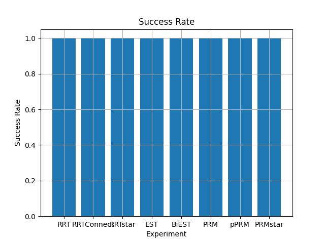
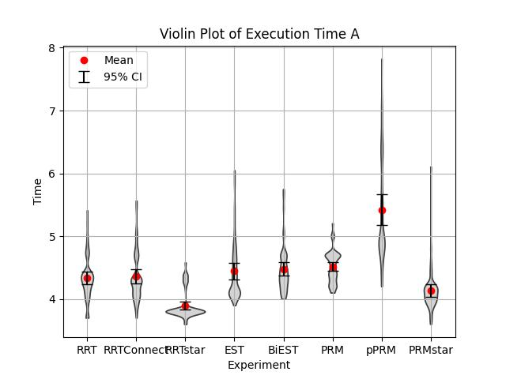
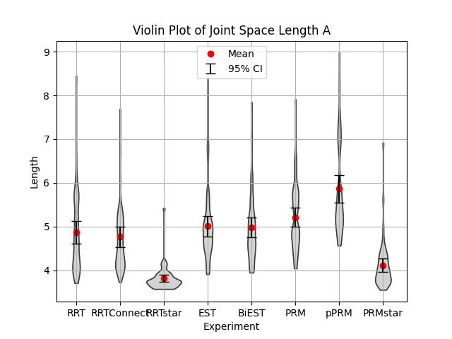
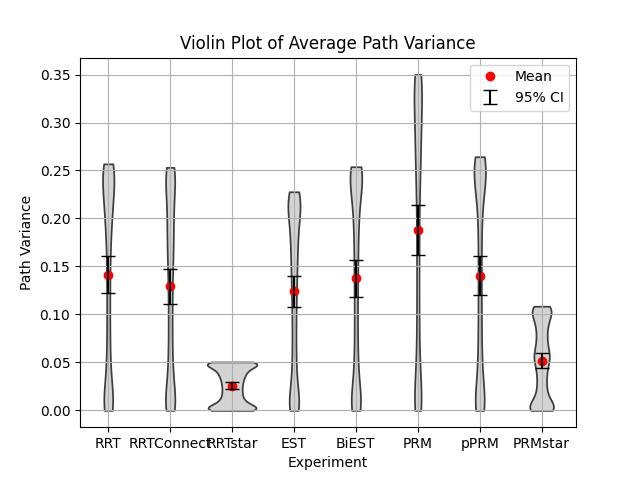
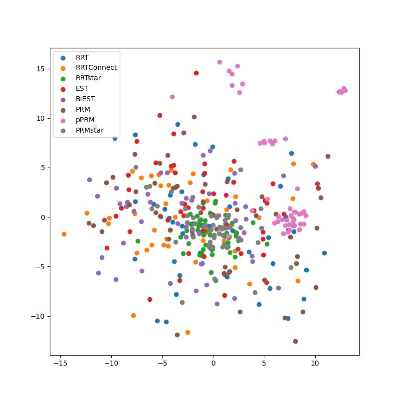

# Motion Analysis

This project is focused on **analyzing motion data** to extract meaningful insights. We developed `mylib.analyser` package providing tools and algorithms for processing, visualizing, and interpreting motion-related datasets (saved in **`data`**). By executing the Python program `generate_result.py`, the **same figures** used as experimental results provided in our bachelor thesis *"Comparative Study of Motion Planning Algorithms for Niryo Robotic Arm"* will be generated in the `results` directory.

## Features
The following figures are generated in the project.
For each example, we provide the result on test scene `ceiling` with 8 tested algorithms. The same types of figures are generated for all of 6 test scenes in our experiment. The results are saved in the `results/<test-scene-name>` directory.
- Success rate comparison
<p align="center">
    
</p>

- Planning time comparison
<p align="center">
    
</p>

- Execution time comparison
<p align="center">
    
</p>

- Path length comparison
<p align="center">
    
</p>

- Path variance comparison
<p align="center">
    
</p>

- Visualization of motion trajectories in 2D using PCA (Principal Component Analysis)
<!-- <p align="center">
    
    
</p> -->

| <br>**Trajectories Represented as 2D Dots** | <br>**Trajectories Represented as 2D Lines** |
|:--:|:--:|

- Joint trajectories plot
    Find `results/<test-scene-name>/joint_trajectory`.


## Installation

1. Navigate to the project directory:
    ```bash
    cd motion_analysis
    ```
2. Create a virtual environment **(optional)**:
    ```bash
    python3 -m venv venv
    ```
3. Activate the virtual environment **(optional)**:
    ```bash
    source venv/bin/activate
    ```
4. Install dependencies:
    ```bash
    pip3 install -r requirements.txt
    ```

## Usage

1. Unzip `data.zip` in the project. Unzipped data should be named as `data/`. Run the following command to unzip:
    ```bash
    unzip data.zip
    ```
2. Prepare your motion data in the supported format.
3. Run the analysis script:
    ```bash
    python3 analyze_motion.py --input data/sample_motion_data.csv
    ```
4. View the results in the output directory `results`.


## Contents of `data` Directory
During our experiment (link: [`../ned2_experiment`](../ned2_experiment/README.md)) , 8 algorithms are tested on 6 test scenes. Therefore, `data` contains 6 subdirectories for the results on each test scenes, and each subdirectory , named as `data/<test_scene_name>`, contains 8 subdirectories for each tested algorithms. 
As we iterated experiment 50 times on every combination of test scene and algorithm, `data/<test_scene_name>/<algorithm_name>` contains 50 csv files of desired/actual motion plan with corresponding time sequence at most. The copy of test configuration file in yaml format is also included in each directory.

```
./
|- data/
   |- <test_scene_name1>
   |  |- <algorithm_name1>
   |  |  |- <planner_id>_0.csv
   |  |  |- ...
   |  |  |- <planner_id>_49.csv
   |  |  \- <planner_id>_experiment_config.yaml
   |  |- ...
   |  \- <algorithm_name8>
   |- ...
   \- <test_scene_name6>
```