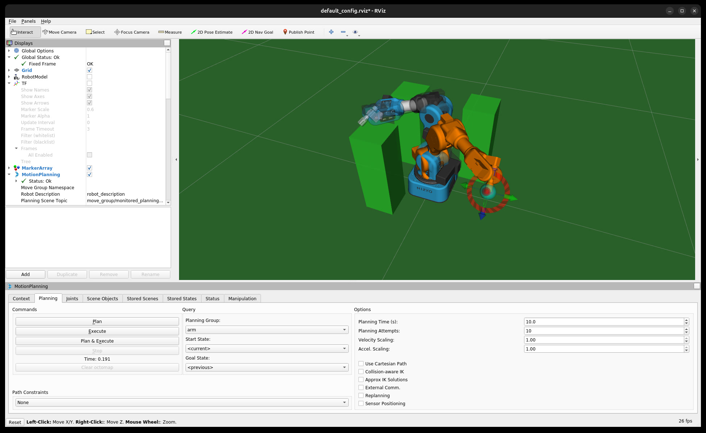
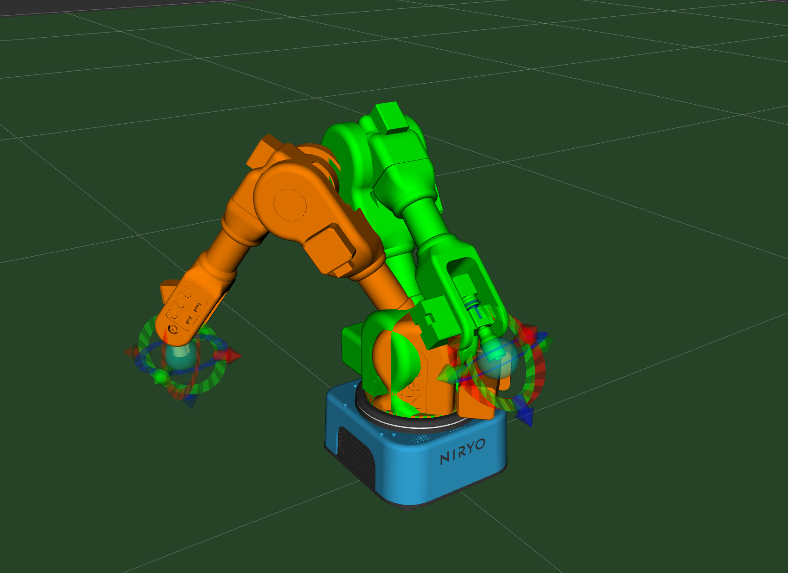
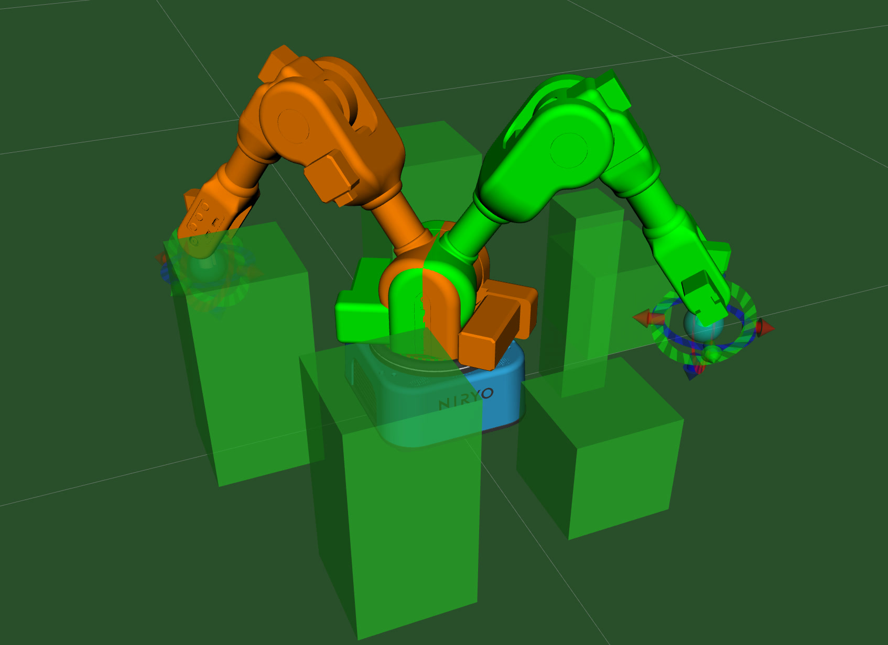
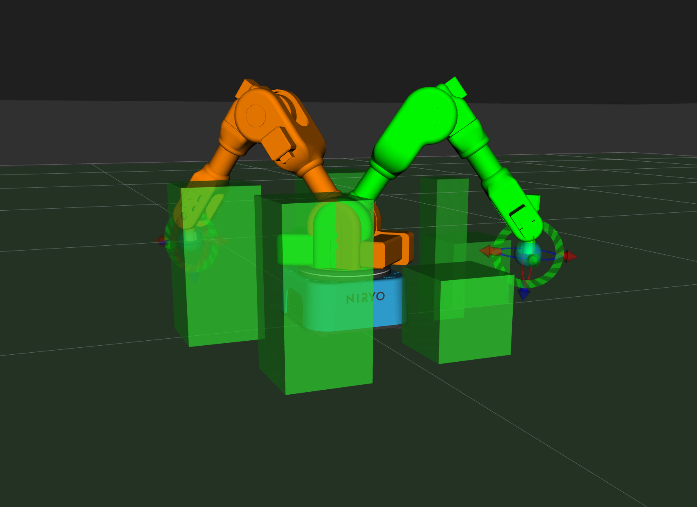
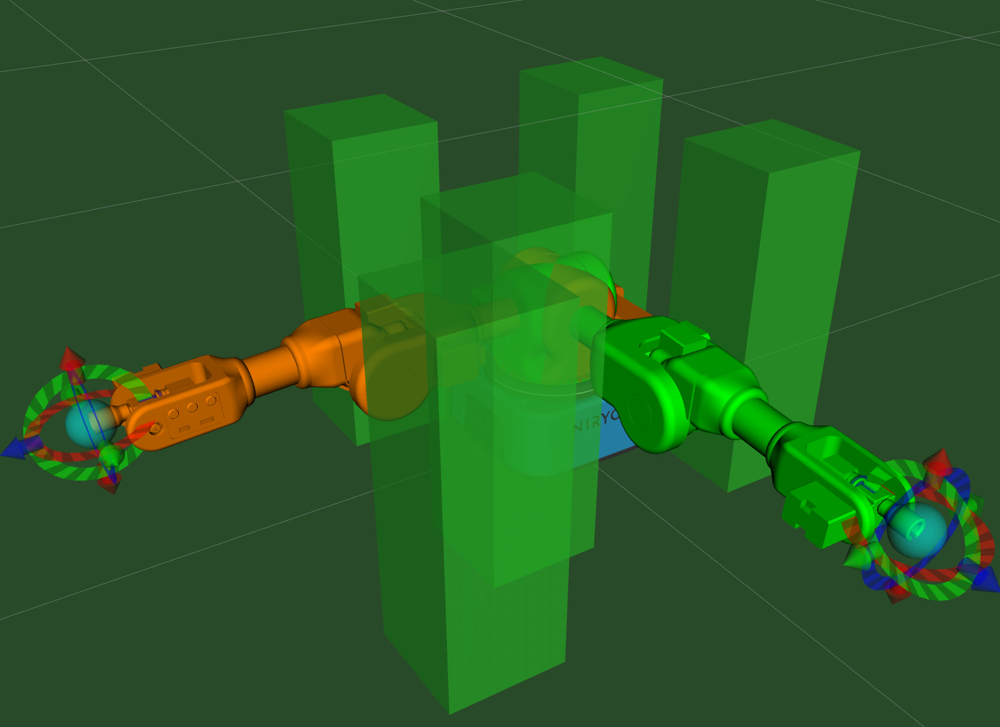
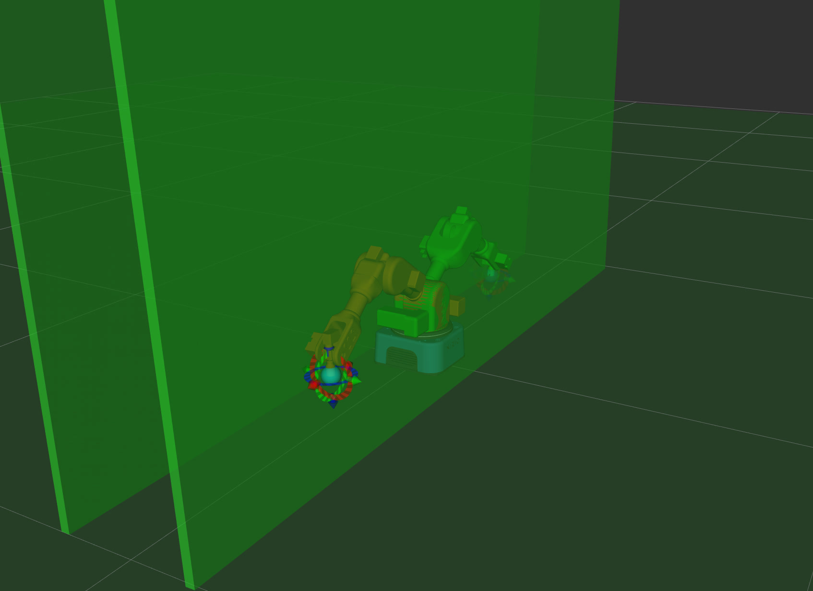
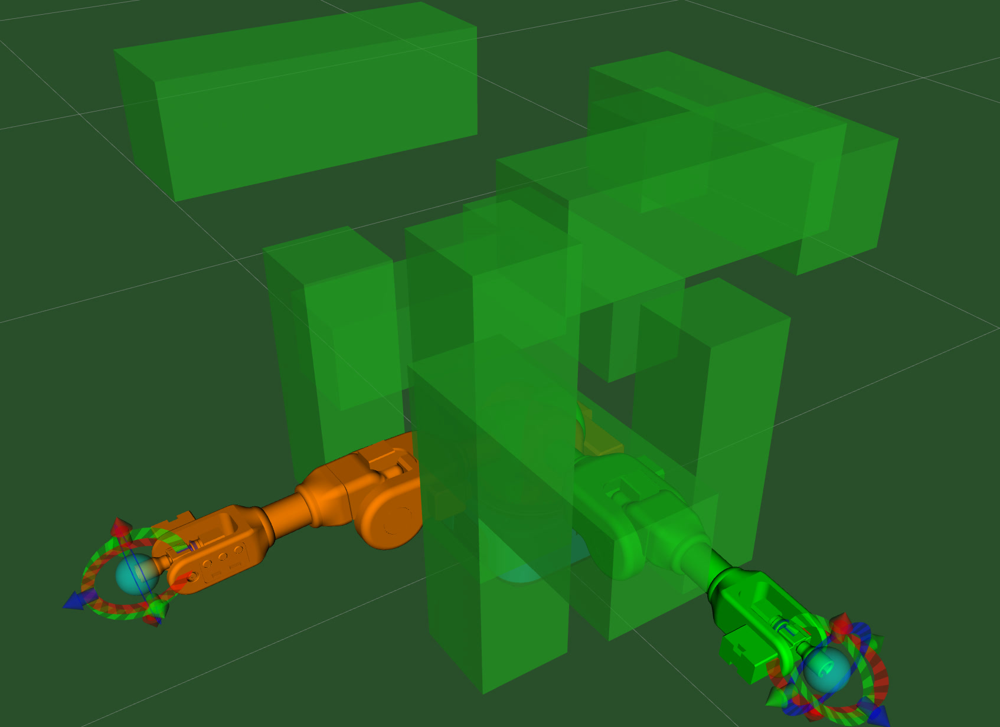

# Experiment on Niryo Ned2: Execution and Recording of Planned Motions

This project is part of **the main practical work** of the bachelor's final project *"Comparative Study of Motion Planning Algorithms for Niryo Robotic Arm"*. **Automated iterative testing** of selected algorithm and test scene is provided. Parameters for each testing, such as number of iterations, can be set via configuration file in *yaml* format.

The output data is supposed to be analyzed in the project [**<u>motion_analysis</u>**](../motion_analysis/README.md) to compare the performance of different motion planning algorithms based on the collected data by this project. The output data we collected during the experiment is zipped as `data.zip` located in the [**<u>motion_analysis</u>**](../motion_analysis/README.md) project directory.

The implementation is based on the **ROS noetic stack** using **MoveIt! C++ API**, which enables the execution of motion planning algorithms provided by **OMPL** on real robotic environment.

## Features
- Execute selected motion planning algorithm and test scene.
- Record the planned and executed motion in a file at the selected location.
- Easy configuration of testing parameters via a yaml file.
    Please click [***<u>HERE (demo_video.mp4)</u>***](media/demo_video.mp4) to watch the demo video **with sound**!!

<p align="center">
    <figure align="center">
        
        <figcaption><b>Demonstration of the Automated Testing for Ned2:</b> The <i>Default PRM Planner</i> is used and <i>three iterations</i> of test on <i>test scene 4</i> were conducted in this demo. Please check the video with sound!</figcaption>
    </figure>
</p>

- Launch RViz with the virtual Ned2.
<p align="center">
    <figure align="center">
        
    </figure>
</p>

- Simplified setup with Docker and pre-configured ROS Noetic environments. (No need of manually running ```catkin_make``` in each workspace)

## Project Structure
- **`src/`**: Core application files (ROS packages) integrated into the custom workspace `ws_compare_alg`. Three ROS packages are included:
    - **`compare_alg`**: Repeat planning and execution of motion as set in the configuration file (`compare_alg/config/compare_alg_config.yaml`).
    - **`record_experiment`**: Record the planned and executed motion by reading `rostopic` and saving the data in a file.
    - `niryo_rviz_launcher`: For launching RViz with virtual Ned2 matching its pose with the connected real robot hardware.
- **`test_scenes`**: Examples of test scenes. Each file defines the positions and orientations of obstacles. It can be easily imported via RViz GUI. (also see [Overview of Test Scenes Used in Our Experiment](#overview-of-test-scenes-used-in-our-experiment))


- *Docker Environment*: Includes:
    - Niryo Ned's ROS stack (workspace) cloned from [https://github.com/NiryoRobotics/ned_ros.git](https://github.com/NiryoRobotics/ned_ros.git).
    - Our custom workspace (**`ws_compare_alg`**) for motion planning algorithm benchmarking on the real robot Ned2.


## Overview of Test Scenes Used in Our Experiment

The start and goal poses are shown in green and orange, respectively.

| Image | Description | Scene Object Definition File | Configuration File |
|:--:|--|--|--|
|  | Test scene 1: No obstacles. Only with ground. | [`base.scene`](test_scenes/base.scene) | [`config_base.yaml`](src/compare_alg/config/config_base.yaml) |
|  | Test scene 2: Short obstacles | [`short.scene`](test_scenes/short.scene) | [`config_short.yaml`](src/compare_alg/config/config_short.yaml) |
|  | Test scene 3: Short obstacles under a 0.45 m high ceiling | [`ceiling.scene`](test_scenes/ceiling.scene) | [`config_ceiling.yaml`](src/compare_alg/config/config_ceiling.yaml) |
|  | Test scene 4: Obstacles forming five columns around the robot | [`four_col.scene`](test_scenes/four_col.scene) | [`config_four_col.yaml`](src/compare_alg/config/config_four_col.yaml) |
|  | Test scene 5: Two parallel walls | [`walls.scene`](test_scenes/walls.scene) | [`config_walls.yaml`](src/compare_alg/config/config_walls.yaml) |
|  | Test scene 6: Maze-like configuration of obstacles | [`maze.scene`](test_scenes/maze.scene) | [`config_maze.yaml`](src/compare_alg/config/config_maze.yaml) |


## Configuration Parameters
The parameters that can be set for each test in the yaml file `compare_alg/config/compare_alg_config.yaml` are explained here.

| Parameter     | Description                     |
| ------------- | ------------------------------- |
| `init_pose`   | Initial pose of the robot      |
| `start_pose`  | Start pose of the robot |
| `goal_pose`  | Goal pose of the robot |
| `max_planning_time`  | Maximum planning time for planner |
| `planning_attempts`  | Number of planning attempts for each iteration |
| `max_velocity_scaling_factor`  | Maximum velocity scaling factor for robot motion |
| `max_acceleration_scaling_factor`  | Maximum acceleration scaling factor for robot motion|
| `planner_id`    | Planner ID (e.g. `PRMkConfigDefault`) |
| `dir_name`    | Name of the output directory (e.g. "/tmp") |
| `num_iterations`    | Number of iterations for the experiment with the same configuration |
| `config_file_path`    | Path to the configuration file `compare_alg_config.yaml` |
| `enable_speech`    | Enable narration of the experiment from speaker (e.g. `true` or `false`) |

Available planner IDs can be found by running the following command either on docker's terminal or Ned2:
```bash
rosparam get /move_group/arm/planner_configs
``` 


## Getting Started

### Prerequisites
- Docker installed.
- Access to Niryo Ned2 robot hardware. (**Remark:** Simulation on RViz is **still available** (follow [Setup without robot hardware](#on-the-niryo-ned2-robot-setup-with-robot-hardware)). **However**, the main objective of this project is to execute motion planning algorithm in **real robotic environment**.)
<!-- , and our main applications **`compare_alg`**, **`record_experiment`** **won't** work without robot hardware. )  -->

### Setup
#### On your host machine
1. Build the Docker image:
   ```bash
    ./build_docker.sh
   ```
2. Set correct `ROS_MASTER_URI` and `ROS_IP` by changing `ROBOT_IP` and `HOST_IP` in the **`run_docker.sh`** file. 
   e.g.:
    ```bash
    # Connection via WiFi
    ROBOT_IP=10.10.10.10
    HOST_IP=10.10.10.62
    ```
    or 
    ```bash
    # Connection via Ethernet
    ROBOT_IP=169.254.200.200
    HOST_IP=169.254.133.162
    ```
    or 
    ```bash
    # Docker simulation (without robot hardware)
    ROBOT_IP=localhost
    HOST_IP=localhost
    ```

    
3. Run the Docker container:
   ```bash
    ./run_docker.sh
   ```
or, if you want to set the environment without docker:
Follow the instructions provided by the official Ned2's stack documentation ([Ubuntu 20.04 Installation](https://niryorobotics.github.io/beta_ned_ros_doc/installation/install_for_ubuntu_20.html)).

#### On the Niryo Ned2 robot (Setup with robot hardware)
If you **don't** have your own robot, please ignore this section.
1. Connect to the robot via SSH. (official instructions: [Connect to your robot](https://niryorobotics.github.io/beta_ned_ros_doc/introduction/quick_start.html#connect-to-your-robot))

2. Make sure that **both** your docker container and Ned2 share the same `ROS_MASTER_URI`, and were set correct `ROS_IP`.
Check on **both** terminals by running:
    ```bash
    echo $ROS_MASTER_URI
    echo $ROS_IP
    ```
3. (if necessary) If you need to overwrite them, use this template:
    ```bash
    export ROS_MASTER_URI="<new ROS_MASTER_URI>"
    export ROS_IP="<new ROS_IP>"
    ```
    Then, the Ned2 robot must be restarted by running    (or follow [Starting Robot Manually](https://niryorobotics.github.io/beta_ned_ros_doc/introduction/use_your_robot.html#starting-the-robot-manually-for-advanced-users-only)):
    To stop Ned2 ROS stack,
    ```bash
    sudo service niryo_robot_ros stop
    ```
    To restart,
    ```bash
    source ~/setup.bash
    roslaunch niryo_robot_bringup niryo_ned2_robot.launch
    ```

4. Calibrate the robot using rosservice:
   ```bash
   rosservice call /niryo_robot/joints_interface/calibrate_motors "value: 1"
   ```
   
#### On the Niryo Ned2 robot (Setup without robot hardware)
It is possible to run the project with **simulated** Ned2 in ROS if you don't have access to the robot hardware.
1. Open another terminal in the same docker container by running:
   ```bash
   docker exec -it ned-ros-container /bin/bash
   ```
2. Start roscore:
   ```bash
   roscore
   ```
3. Open another terminal as we did in the first step, and start the Ned2 simulation:
   ```bash
   roslaunch niryo_robot_bringup niryo_ned2_simulation.launch
   ```

### Usage
#### Set Test Scene
1. Launch RViz by running on docker's terminal:
    ```bash
    roslaunch niryo_rviz_launcher niryo_rviz.launch
    ```
2. Place obstacles:
    Place obstacles in the "Scene Objects" tab in the "Motion Planning" panel. Or in the tab, import from our example testscenes stored in **`test_scenes`** directory.


#### Automated Testing
1. Set the configuration parameters for the test in the yaml file `compare_alg/config/compare_alg_config.yaml` ([Configuration Parameters](#configuration-parameters)). 

2. Run the test:
    ```bash
    roslaunch compare_alg compare_alg.launch
    ```

#### Copying Output from Docker
1. This project is only meant to collect quantative data of planned/executed motion plans. The output files are stored in the directory specified in the `dir_name` parameter of the configuration file. Use this command on your host terminal to copy the files.

    ```bash
    docker cp <container_id>:<dir_name> /path/on/host
    ```
